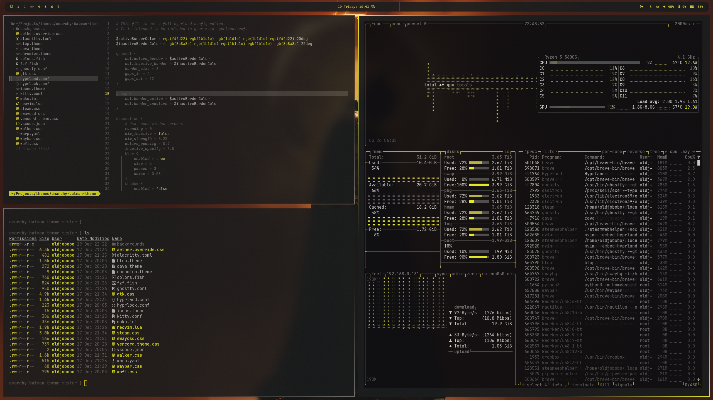
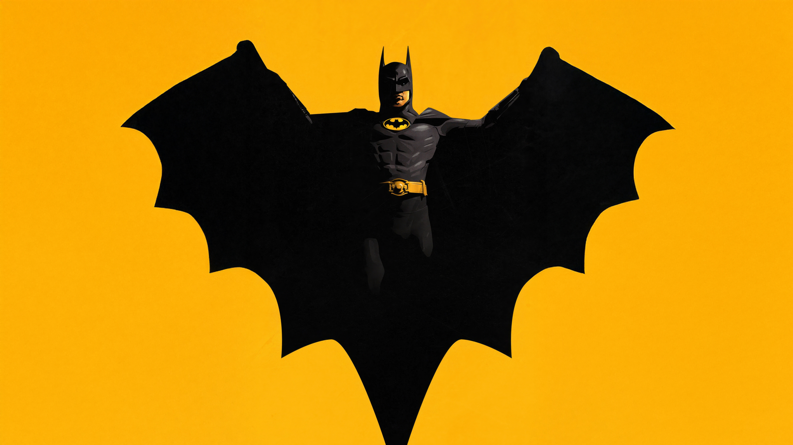
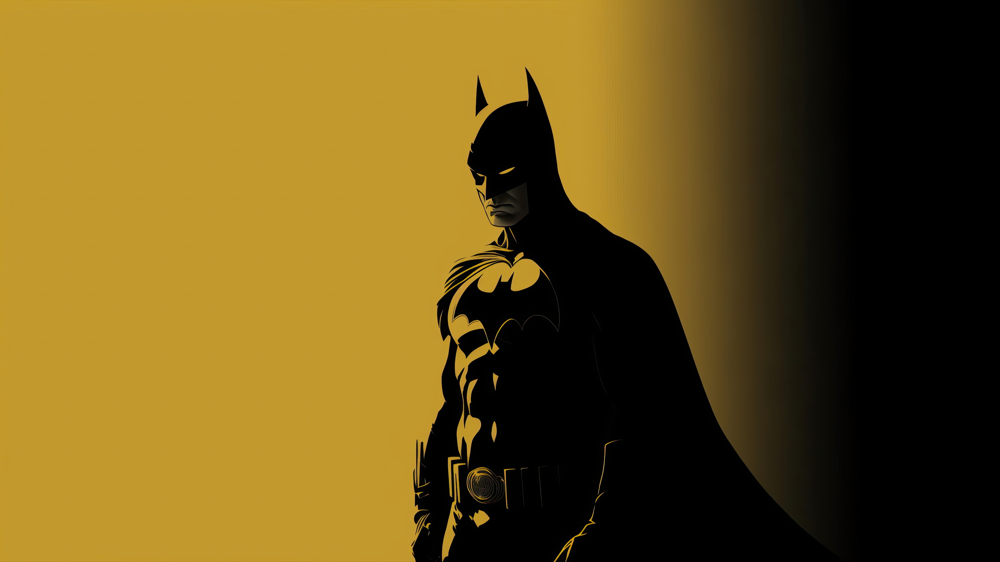
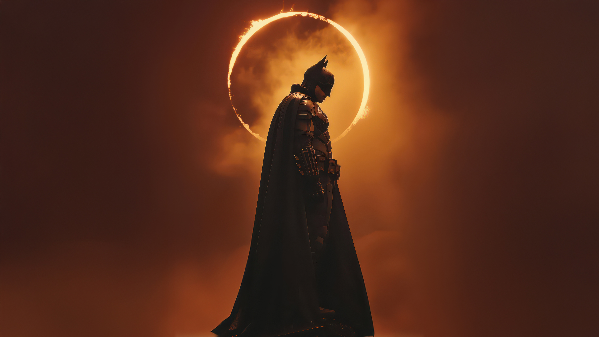
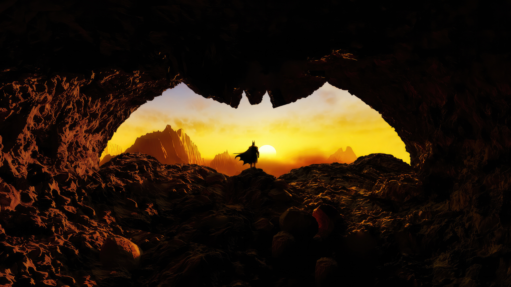

# Omarchy Batman Theme

I was inspired to build this after discovering the Batman color scheme in Ghostty. It felt so unusual that I had to see what the full desktop would look like. The goal is a bold, moody look that keeps the palette disciplined and the visuals clean for long sessions.



## What's included
- Hyprland: custom border colors, 3px borders, and opacity rules (`hyprland.conf`)
- Hyprlock colors for ring and text (`hyprlock.conf`)
- Waybar colors (`waybar.css`), based on https://github.com/HANCORE-linux/waybar-themes?tab=readme-ov-file by HANCORE-Linux
- Terminals: Alacritty (`alacritty.toml`), Ghostty (`ghostty.conf`), Kitty (`kitty.conf`), Warp (`warp.yaml`)
- Shell/UI tools: btop (`btop.theme`), Cava (`cava_theme`), fzf (`fzf.fish`), fish colors (`colors.fish`)
- Notifications and helpers: Mako (`mako.ini`), SwayOSD (`swayosd.css`), Walker launcher (`walker.css`), Wofi (`wofi.css`)
- Neovim Aether colorscheme + LazyVim config (`neovim.lua`), VS Code (`vscode.json`)
- GTK + Aether overrides (`gtk.css`, `aether.override.css`)
- Browser + apps: Chromium (`chromium.theme`), Steam (`steam.css`), Vencord (`vencord.theme.css`)
- Icon theme pointer (`icons.theme`)

## Quick start
Run the installer and it will place everything where it belongs:

```bash
omarchy-theme-install https://github.com/OldJobobo/omarchy-batman-theme
```

Wallpapers live in `backgrounds/`; `preview.png` and `preview2.png` show the intended look.

## Background previews
<table>
  <tr>
    <td align="center" valign="top"><br><sub>batman-arkham-3840x2160-18364.jpg</sub></td>
    <td align="center" valign="top"><br><sub>batman-hope-takes-flight-kh-3840x2160.jpg</sub></td>
    <td align="center" valign="top"><br><sub>batman-in-yellow-dg-3840x2160.jpg</sub></td>
    <td align="center" valign="top"><br><sub>batman-silhouette-dc-comics-dc-superheroes-3840x2160-927.jpg</sub></td>
  </tr>
  <tr>
    <td align="center" valign="top"><br><sub>batman-the-dark-detective-h9-3840x2160.jpg</sub></td>
    <td align="center" valign="top"><br><sub>dc-batman-classic-ec-3840x2160.jpg</sub></td>
    <td align="center" valign="top"><br><sub>gotham-guardian-batman-l5-3840x2160.jpg</sub></td>
    <td align="center" valign="top"><br><sub>wallhaven-1j3yr1.jpg</sub></td>
  </tr>
  <tr>
    <td align="center" valign="top"><br><sub>wallhaven-3zg9z3.jpg</sub></td>
    <td align="center" valign="top"><br><sub>wallhaven-6llxkw.jpg</sub></td>
    <td align="center" valign="top"><br><sub>wallhaven-723ljy.jpg</sub></td>
  </tr>
</table>

## Notes
- Hyprland rules enforce full opacity on active windows and slight dimming on inactive ones; adjust `windowrule` lines if you want different defaults.
- Waybar styling is derived from HANCORE-Linux's Waybar themes collection and adjusted to match the Batman palette.
