# Omarchy Batman Theme

I was inspired to build this after discovering the Batman color scheme in Ghostty. It felt so unusual that I had to see what the full desktop would look like. The goal is a bold, moody look that keeps the palette disciplined and the visuals clean for long sessions.

The palette remains grounded in the original Ghostty/iTerm2 graphite-and-yellow Batman theme. `batman-base24.yaml` preserves the canonical Tinted Theming Base24 conversion, while `colors.toml` adapts its semantic ramp for Omarchy and retains the original terminal ANSI, cursor, and selection colors exactly.

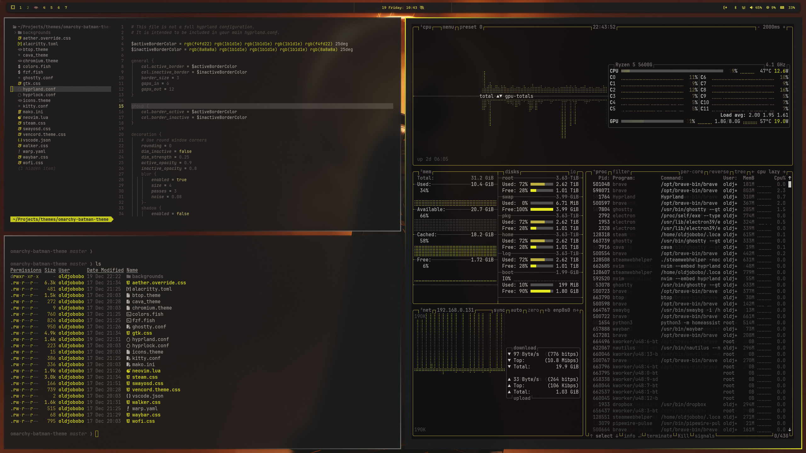
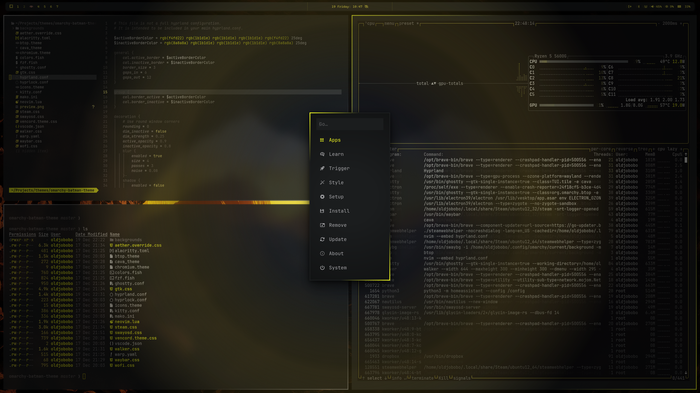

## What's included
- Omarchy Quattro: semantic Base24 palette (`colors.toml`), native shell surfaces (`shell.toml`), and Lua Hyprland treatment (`hyprland.lua`)
- Canonical palette reference (`batman-base24.yaml`), sourced from Tinted Theming's Base24 Batman scheme by FredHappyface
- Hyprland 3.8 compatibility: custom border colors, 3px borders, and opacity rules (`hyprland.conf`)
- Hyprlock compatibility palette variables (`hyprlock.conf`)
- Legacy Waybar colors (`waybar.css`), based on https://github.com/HANCORE-linux/waybar-themes?tab=readme-ov-file by HANCORE-Linux
- Terminals: Alacritty (`alacritty.toml`), Foot (`foot.ini`), Ghostty (`ghostty.conf`), Kitty (`kitty.conf`), Warp (`warp.yaml`)
- Shell/UI tools: btop (`btop.theme`), Cava (`cava_theme`), fzf (`fzf.fish`), fish colors (`colors.fish`)
- Notifications and helpers: Mako (`mako.ini`), SwayOSD (`swayosd.css`), Walker launcher (`walker.css`), Wofi (`wofi.css`)
- Neovim Aether colorscheme + LazyVim config (`neovim.lua`), VS Code (`vscode.json`)
- GTK + Aether overrides (`gtk.css`, `aether.override.css`)
- Browser + apps: Chromium (`chromium.theme`), Steam (`steam.css`), Vencord (`vencord.theme.css`)
- Icon theme pointer (`icons.theme`)

## Quick start
Run the installer and it will place everything where it belongs:

```bash
omarchy theme install https://github.com/OldJobobo/omarchy-batman-theme
omarchy theme set batman
```

## Legacy Waybar install

Omarchy Quattro uses the native shell treatment in `shell.toml`. For older Waybar-based Omarchy installations, back up your existing Waybar config and copy the compatibility theme files:

```bash
mkdir -p ~/.config/waybar.backup
cp -a ~/.config/waybar/* ~/.config/waybar.backup/
cp -a waybar-theme/* ~/.config/waybar/
omarchy-restart-waybar
```

Wallpapers live in `backgrounds/`; `preview.png` and `preview2.png` show the intended look.

## Background previews

| | | |
| --- | --- | --- |
| 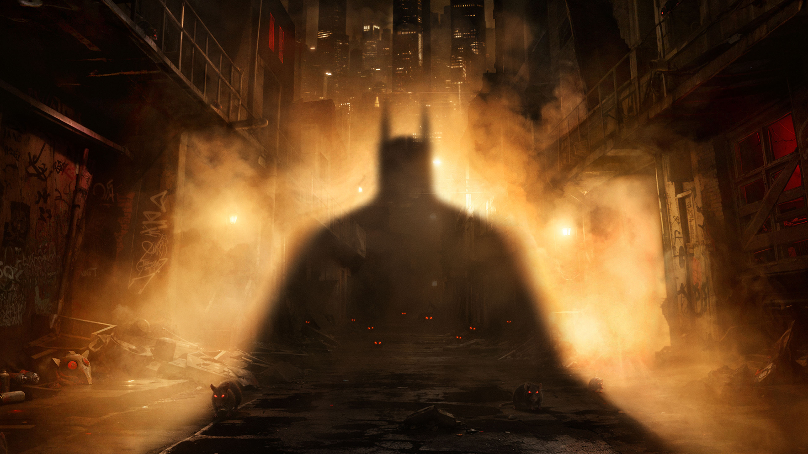 | 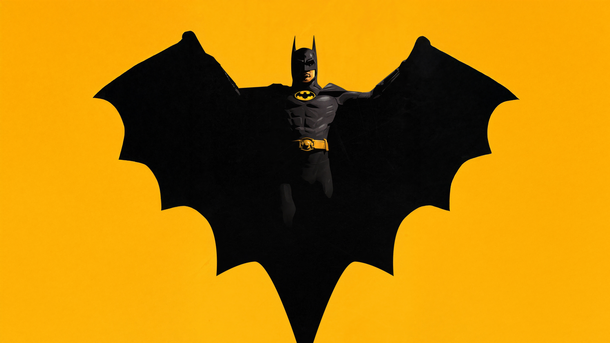 | 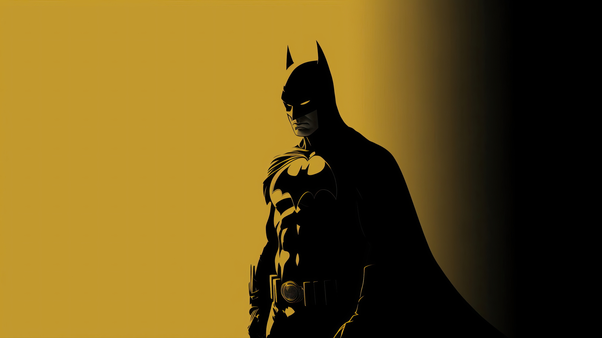 |
| 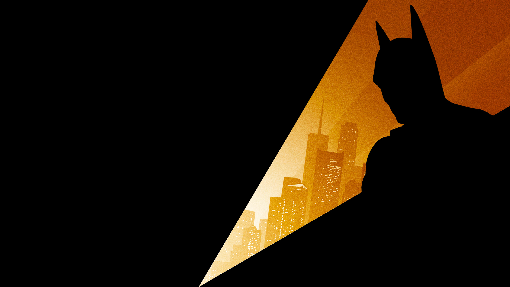 | 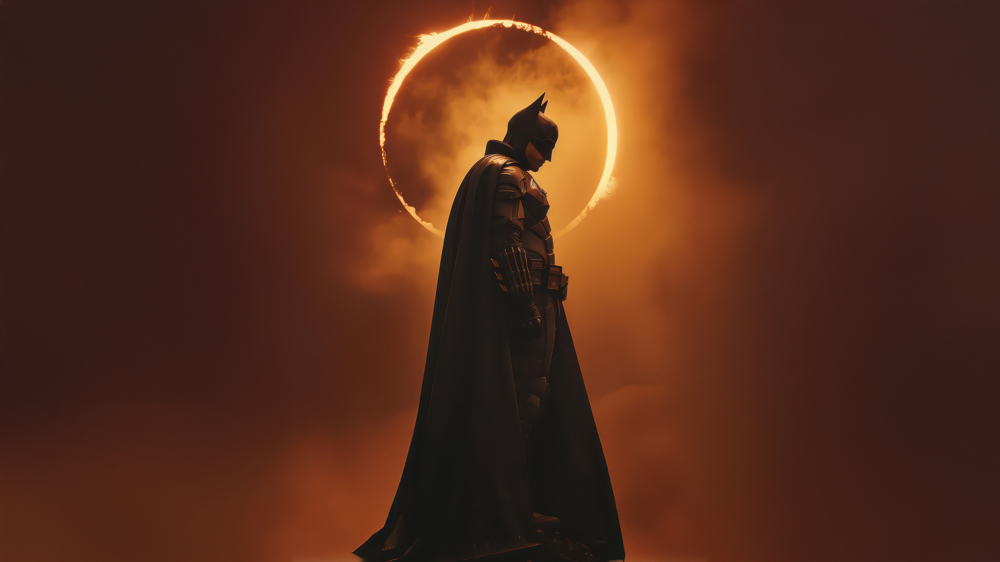 | 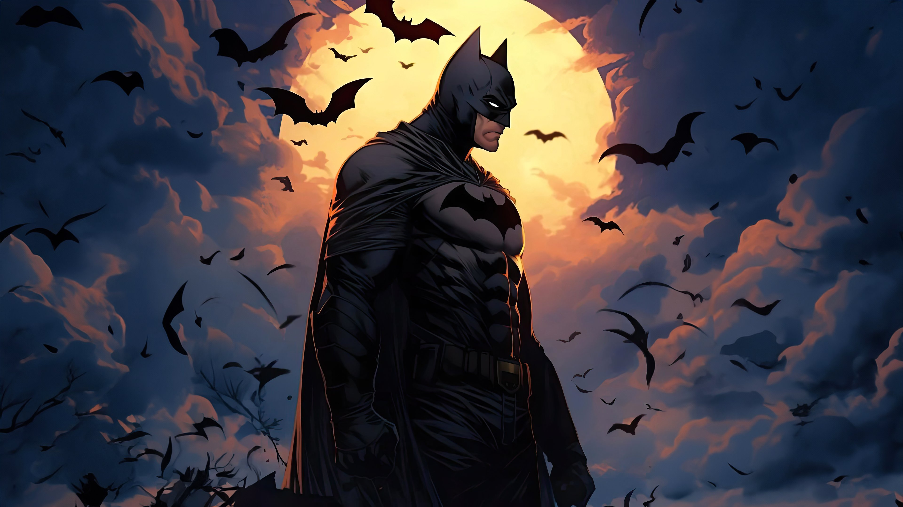 |
| 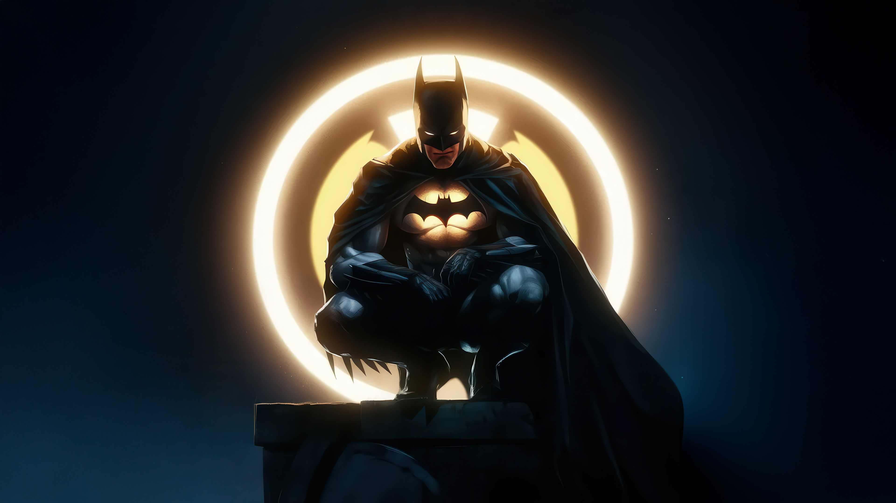 | 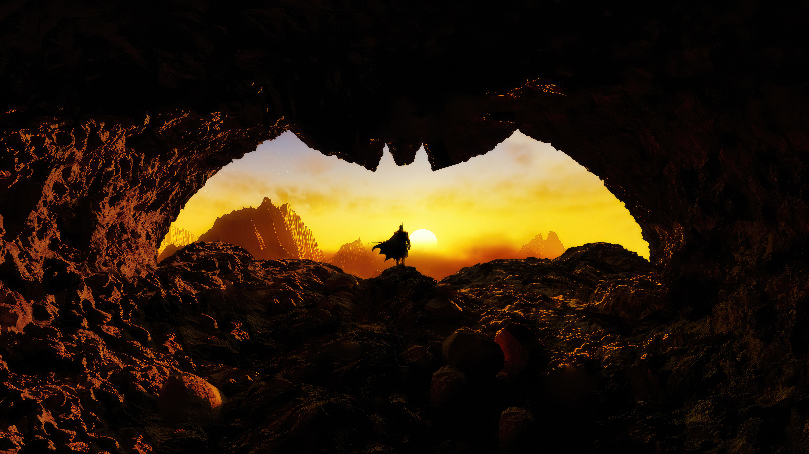 | 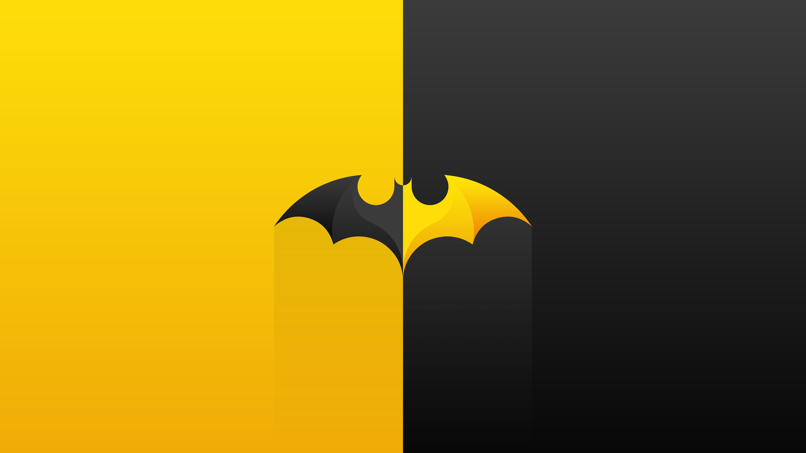 |
| 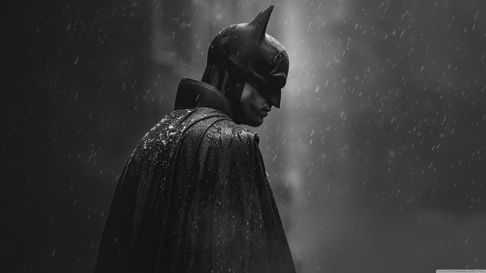 | 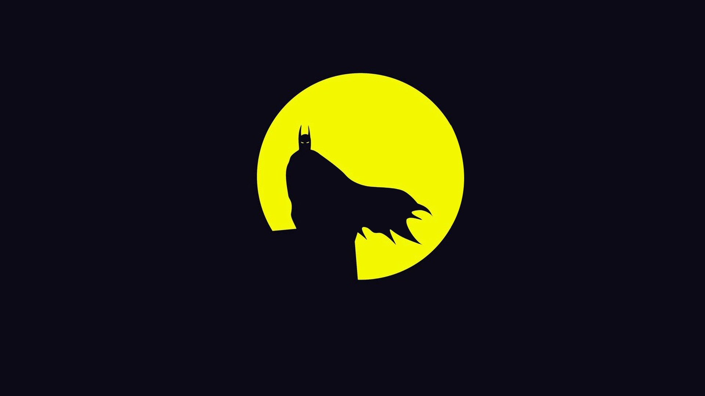 | 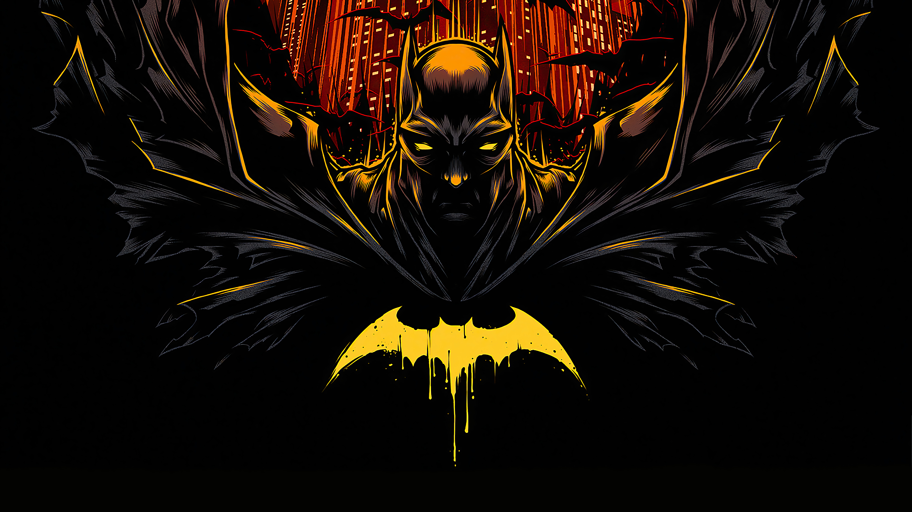 |
| 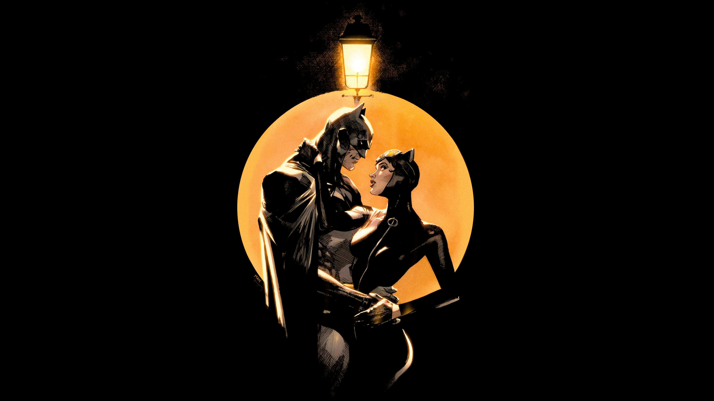 | 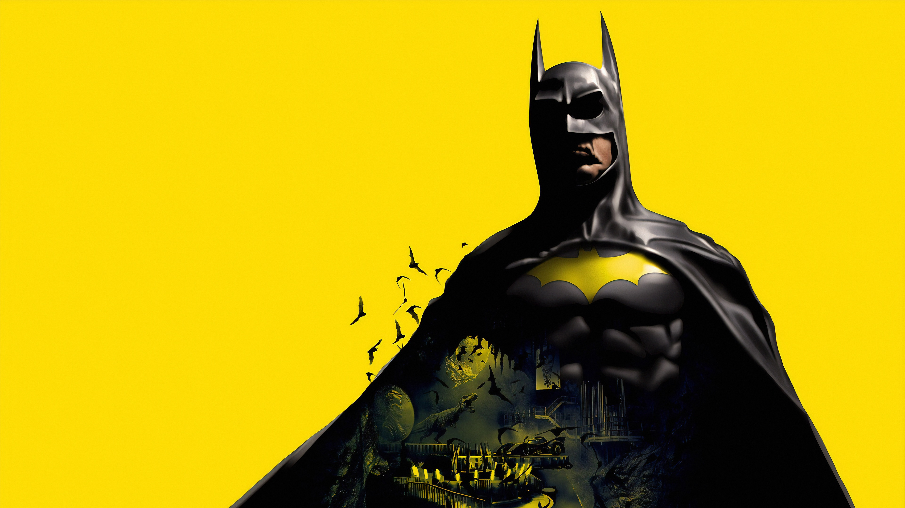 |  |

## Notes
- Waybar styling is derived from HANCORE-Linux's Waybar themes collection and adjusted to match the Batman palette.
